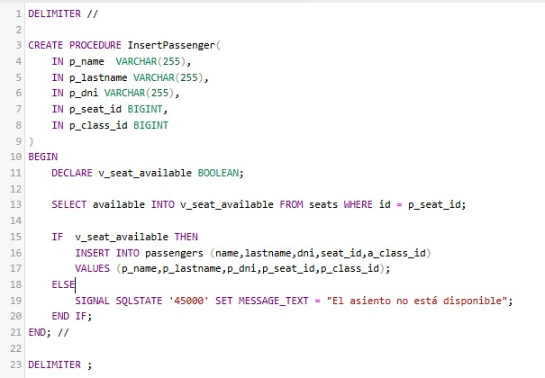

# Parcial de Base de Datos

## Tecnologías Utilizadas

- 
- 
- 
- 

## Escenario

Una compañía aérea necesita una base de datos para registrar la información de sus vuelos. Los vuelos están caracterizados por un Id, la fecha y los aeropuertos de origen y destino. Cada vuelo es realizado por un avión. Los aviones tienen una matrícula que los identifica, el fabricante, un modelo e información sobre su capacidad (número máximo de pasajeros) y autonomía de vuelo (en horas).

La tripulación asignada al vuelo está formada por el personal de la propia compañía. De cada trabajador se conoce su id, su nombre y su categoría profesional, así como el puesto que ocupa en cada vuelo en particular. Por último, para cada vuelo, se almacena la lista completa de pasajeros, con su DNI, el nombre, el asiento que ocupa y su clase (turista, primera o business). 

Construye el modelo conceptual y el modelo lógico correspondientes al enunciado expuesto.

## Consignas

1. La normalización de las bases de datos. (SQL)
2. Generar el script de creación de las tablas junto con el tipo de cada uno de los campos y la cardinalidad de las tablas, es decir, indicando las constraints. (SQL)
3. Crear un lote de prueba para realizar las operaciones CRUD. (SQL)
4. Seleccionar un par de tablas representativas para realizar un cursor en un stored procedure. (SQL)
5. Seleccionar un par de tablas representativas para realizar un trigger. (SQL)

## Diagrama Entidad-Relación

##  Creación del Trigger
#### ¿Que es un Trigger?
Un trigger (o desencadenador) es un conjunto de instrucciones que se ejecutan automáticamente en respuesta a
ciertos eventos en una base de datos. Estos eventos pueden incluir operaciones como inserciones, actualizaciones
o eliminaciones en una tabla específica.

Trigger que actualiza la disponibilidad del asiento, inicialmente se lo persiste en TRUE, cuando se le asigna el asiento
a un pasajero (passenger) el estado se cambia a FALSE indicando que ya no esta disponible para otro pasajero.

## Creación del Store Procedure
#### ¿Que es un Store Procedure?
Un stored procedure (procedimiento almacenado) es un conjunto de instrucciones SQL que se guardan en la base de datos y se pueden ejecutar de manera repetida. 
Los stored procedures permiten encapsular lógica de negocio, manipulación de datos y operaciones complejas en un único bloque de código, que se puede invocar desde aplicaciones o desde otros procedimientos.

### Llamada al Store Procedure

En este ejemplo se insertaría un nuevo pasajero, asignandole un asiento con el ID 4 y la clase con el ID 1, y asegurando que el asiento esté disponible antes de la inserción.

